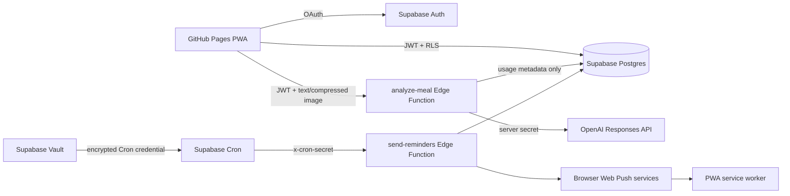

# Architecture and security boundaries

## Main flows

## Photo lifecycle

1. The browser decodes the selected image with orientation applied.
2. It resizes the longest side to at most 1280 pixels and exports a new JPEG at 78% quality. Re-encoding drops EXIF metadata.
3. The authenticated request carries a Base64 data URL to `analyze-meal`.
4. The Edge Function validates the user, allowlist, type, size and rate limit.
5. The function sends the image to the OpenAI Responses API with strict `text.format` JSON Schema.
6. The function validates the structured result and returns it.
7. The user can add corrections and reprocess the same photo repeatedly, then edit and confirm the proposal.
8. Aggregate nutrition is inserted into `meals`; the confirmed detected components are inserted into `meal_items` and remain protected by meal ownership RLS.

No Storage bucket is required.

## Authorization

The public publishable Supabase key identifies the project, not a privileged user. Every data table has Row Level Security enabled. `meals`, `profiles` and `push_subscriptions` require both `auth.uid()` ownership and an entry in `allowed_users` matching the authenticated email.

The current Supabase secret key (or a legacy service-role key) is available only
inside Supabase Edge Functions. The functions support both key generations. The
AI function still validates the caller’s JWT and allowlist before using server
privileges. The reminder function accepts no user request and requires a
separate Cron secret whose database copy is encrypted in Supabase Vault.

## Structured AI result

The schema is authoritative in `supabase/functions/_shared/meal-schema.ts`. All properties are required, all objects reject additional properties, and nullable values represent uncertainty. The function separately handles refusals and incomplete API responses, then performs application bounds checks even after Structured Outputs validation.

Detected foods are returned to make the estimate understandable and correctable. After confirmation they are persisted as ordered `meal_items`, allowing a user to reopen a meal and see the components behind its totals. Photos themselves remain transient and are never stored.

## Meals and favourites

`meals` is the aggregate nutrition record and owns zero or more `meal_items`. Item policies authorize through the parent meal, and `on delete cascade` prevents orphaned components. A favourite is still a real logged meal marked by `is_favorite`; repeating it creates a new meal occurrence with copied totals and components but does not duplicate the favourite flag or AI confidence.

## Reporting

The frontend loads the authenticated user’s meal history in bounded pages so every meal remains openable. Reporting still aggregates only the selected seven- or thirty-day window, avoiding extra views and materialized tables for the intended small group. Date grouping uses the profile timezone and is covered by boundary/DST tests.

Recommendations use explicit thresholds in `src/lib/nutrition.ts`; they do not spend tokens or turn the model into a health advisor.

## Push idempotency

The reminder schedule is code, not user data. `push_subscriptions` exists because browsers generate a different encrypted endpoint per installed device. `notification_deliveries` has a unique constraint on subscription, notification type and five-minute scheduled slot, preventing retries from sending a duplicate to the same device.
